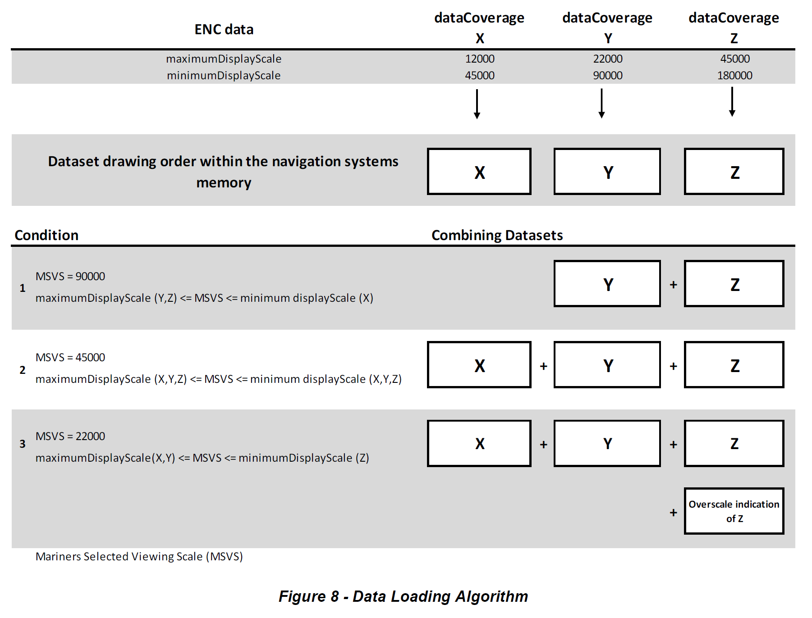
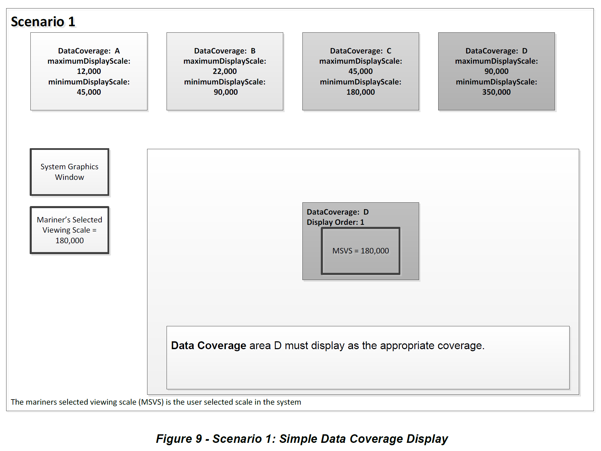
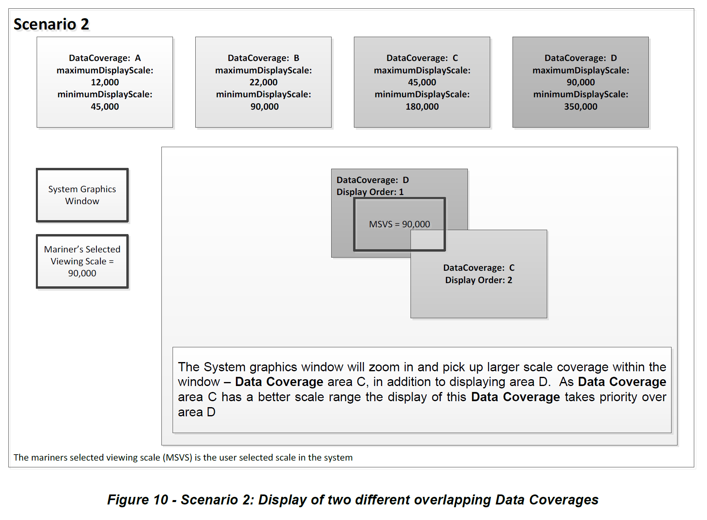
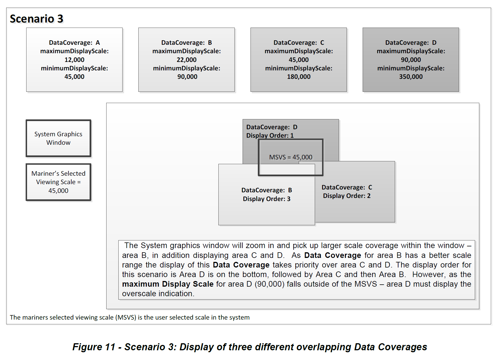
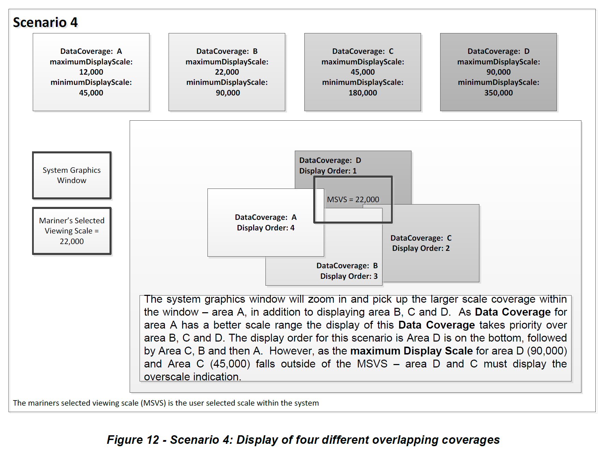

## 4.7 Dataset Loading and Display Order

A new algorithm based on producer defined dataset display scales (minimum and maximum) for dataset loading and unloading within a navigation system is prescribed in S-101 in order for the appropriate ENC to be viewed at the mariner’s selected viewing scale. This will simplify the process for navigation systems, giving clear and concise rules on how and when data is loaded and unloaded. The concept of navigation purpose is restricted for use in presenting ENCs in a visual catalogue and must not be used for determining which dataset should be displayed.

### 4.7.1 Dataset Loading Algorithm

This clause defines the dataset loading and unloading algorithm for use within marine navigation systems.

In order for systems to properly load and unload data as the mariner is zooming in and out using the mariner’s selected viewing scale (MSVS) the following algorithm must be used.

1. Create selection List

 a. All **Data Coverage** areas within the graphics window within scale range (covered by the MSVS) are firstly ordered by **maximum display scale** and secondly by the largest percentage of coverage if **Data Coverage** areas have the same **maximum display scale.**

 b. All other smaller scale **Data Coverage** areas within the graphics window are firstly ordered by **maximum display scale** and secondly by the largest percentage of coverage if **Data Coverage** areas have the same **maximum display scale.**

 c. The display order is from the smallest **maximum display scale** to the largest **maximum display scale**, that is the **Data Coverage** area with largest **maximum display scale** will be displayed with the highest priority.

 d. If adjacent data coverages have the same **maximum display scale** they should be drawn so that all features of a given display priority from the adjacent data coverages 		are drawn prior to drawing features of the next display priority.

2. If the MSVS is larger than the **maximum display scale** of an area within the window, turn on overscale indication.

3. If the mariner selects an individual dataset to load it must be displayed at its **maximum display scale**, that is MSVS is set to the **maximum display scale** of the selected dataset, and then the algorithm is used to fill the graphics window.

The example below works through four scenarios and uses four different types of **Data Coverage** with different **maximum display scale** and **minimum display scale**. They are denoted as areas A, B, C and D.

