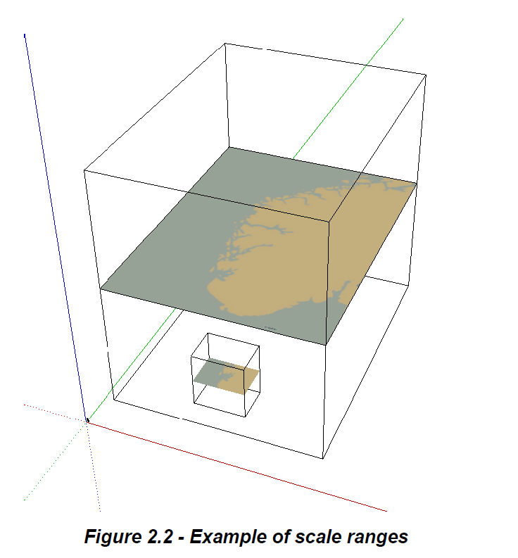
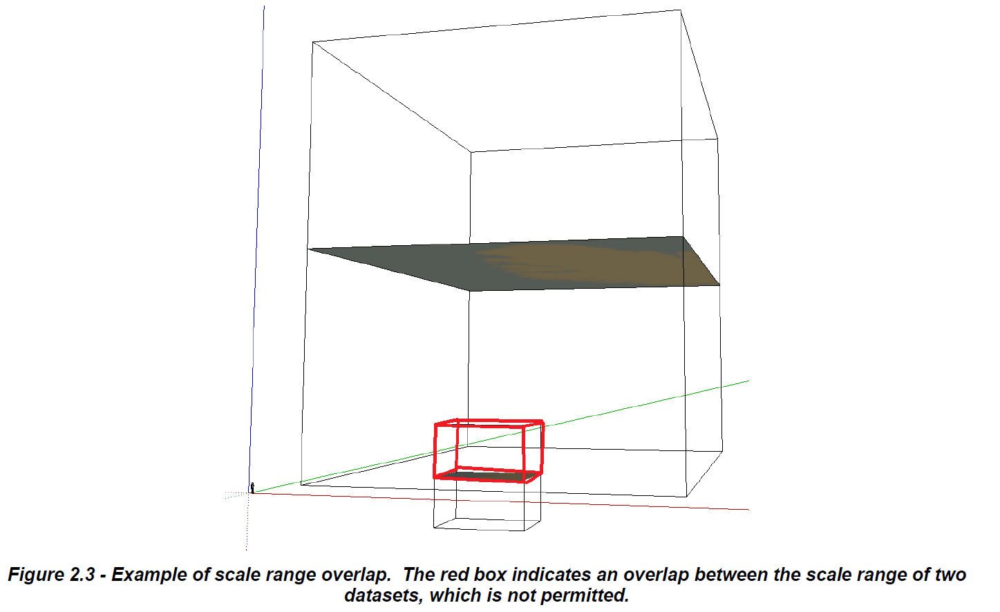

**1.3 Terms, definitions and abbreviations**

**1.3.1 Terms and definitions**

**maximum display scale**

The maximum scale with which the data is displayed

**minimum display scale**

The minimum scale with which the data is displayed

**viewing scale**

the value of the ratio of the linear dimensions of **features** of a **dataset** presented in the display and the actual dimensions of the **features** represented of the **dataset**

**2.5 Datasets**

A Dataset is a grouping of features, attributes, geometry and metadata
which comprises a specific coverage.

Four types of ENC dataset may be produced and contained within an
exchange set:

Update: Changing some information in an existing dataset.

Re-issue of a dataset: Including all the Updates applied to the original
dataset up to the date of the reissue. A Re-issue does not contain any
new information additional to that previously issued by Updates.

New dataset and New Edition of a dataset: Including new information
which has not been previously distributed by Updates. Each New Edition
of a dataset must have the same name as the dataset that it replaces.

**2.5.1 ENC data coverage**

An ENC dataset can contain more than one **Data Coverage** (see clause
3.4). The data boundary is defined by the extent of the **Data
Coverage** meta features. Data must only be present within **Data
Coverage** meta features.

Producing Authorities must not leave "holes" (that is, areas not covered
with data) in smaller scale range coverage, under the assumption that
the ECDIS user will have the larger scale data available. For areas
covered by larger scale ENCs, well established cartographic data
generalization practices should be applied, including the inclusion of
minimum depiction areas (see clause 2.5.3.2 below).

When a feature extends across datasets of overlapping scale ranges, its
geometry must be split at the boundaries of the **Data Coverage**
features and its complete attribute description must be repeated in each
dataset.

An ENC Update dataset must not change the extent of the data coverage
for the base ENC cell. Where the extent of the data coverage for a base
ENC cell is to be changed, this must be done by issuing a New Edition of
the cell.

**2.5.2 Discovery metadata**

Information regarding discovery metadata can be found in the S-101 ENC
Product Specification (main document).

**2.5.3 Minimal depiction areas**

Where minimal depiction areas exist in a specified ENC maximum display
scale, they should be encoded using one of the following options:

**2.5.3.1 Wide blank areas**

Areas of a dataset which contain no data must be excluded from the
area(s) covered by the meta feature **Data Coverage**. The areas that
contain data must be completely covered by **Data Coverage** features.

**2.5.3.2 Simplified or minimum depiction areas**

Bathymetry in such areas should be encoded as described in clause
11.9.2.

Information that does not relate to bathymetry but is relevant to land
area features may be encoded.

One **Caution Area** feature covering the whole area should be created.
The complex attributes **information** (sub-attribute **text** or **file
reference**) should be encoded using one of the following options (the
textual content of the attributes (for **file reference** this will be
the contents of the referenced file) is within quotation marks and
italicised):

Where larger scale coverage is available:

*"Most features, including bathymetry, are omitted in this area. The
minimal depiction of detail in this area does not support safe
navigation; mariners should use a more appropriate scale ENC."*

Any other relevant information pertaining to the area should be
incorporated within, or replace completely, the above statement.

Where no larger scale coverage is available:

*"Most features, including bathymetry, are omitted in this area. The
minimal depiction of detail in this area does not support safe
navigation."*

This statement should be supplemented by additional cautionary
information relating to any authority to be consulted before navigating
in the area.

**2.5.4 Units**

The depth, height and positional uncertainty units in a dataset must be
metres.

**2.5.5 Seamless ENC coverage**

ENCs should form a seamless coverage in the navigable waters of the
producer's area of responsibility. However, it is often impractical to
do so for all ECDIS display scales, and therefore S-101 ENCs declare a
scale range, which dictate between what scales the data can be used.

The meta feature **Data Coverage** (see clause 3.4) is used to provide
the ECDIS with the scale information necessary for the determination of
dataset loading and unloading in relation to the user selected viewing
scale in the ECDIS.

The mandatory attribute **maximum display scale** is used to indicate
the largest intended viewing scale for the data. The mandatory attribute
**minimum display scale** is used to indicate the smallest intended
viewing scale for the data.

An ENC dataset (discovery metadata) and associated **Data Coverage**
feature(s) must carry a value for maximum display scale. Each **Data
Coverage** feature must also carry a value for minimum display scale.
Values for **maximum display scale** and **minimum display scale** must
be taken from the following Table:

  -----------------------------------------------------------------------------------------------------
  **Scale**
  NULL (only allowed on **minimum display scale** where the **maximum display scale** = *10,000,000*)
  1:10,000,000
  1:3,500,000
  1:1,500,000
  1:700,000
  1:350,000
  1:180,000
  1:90,000
  1:45,000
  1:22,000
  1:12,000
  1:8,000
  1:4,000
  1:3,000
  1:2,000
  1:1,000
  -----------------------------------------------------------------------------------------------------

***Table*** ***2.5 - Maximum and minimum display scale values***

The **Data Coverage** features within a dataset must not overlap,
however **Data Coverage** features from different datasets may overlap
if they have differing maximum display scales. All data within a dataset
must have the same minimum display scale, but portions of a dataset can
have a different maximum display scale, depending on the best scale
required for navigation in an area for the purpose of the ENC data.

There must be no gaps in data between adjoining datasets if they share
the same scale range in part or in full. Similarly, there must be no
overlapping data between datasets if they share same scale range in part
or in full, except at the agreed adjoining producer data limits, where,
if it is difficult to achieve a perfect join, a 5 metre overlapping
buffer zone may be used.

To ensure a seamless ECDIS display of ENC data within the same scale
range, it is important that the data on the border of the dataset is
aligned and matched with the corresponding data in any adjoining
datasets within the scale range, where possible. Where there is a
mismatch in depth data between adjoining datasets, editing of the depth
data should be done such that depth contours and depth areas are
adjusted on the side of safety. Edge matching of data across different
scale ranges, particularly depth data, is often not possible due to
generalisation issues resulting from differing scales, although features
such as maritime boundaries, navigation lines, recommended tracks, roads
etc. should be edge matched where possible. Note that point or curve
features which are at the border of **Data Coverage** features (see
clause 3.4) for adjoining cells with the same scale range must be part
of only one dataset.

In areas which include neighbouring producer nations, Hydrographic
Offices should co-operate to agree on dataset boundaries and ensure no
data overlap within scale ranges. Where possible, adjoining nations
should agree on common data boundaries within a technical arrangement
based on cartographic convenience and benefit to the mariner. Suitable
communications between neighbouring nations should be put in place to
ensure data consistency across dataset boundaries. These should include
exchange mechanisms to allow access to each other's ENCs.
